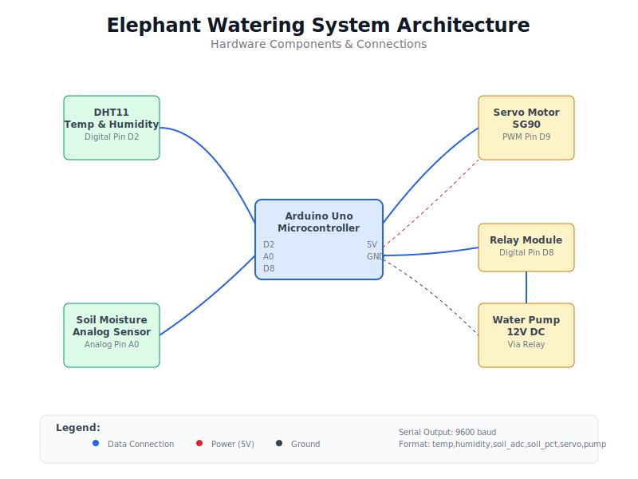

# Physical Mockup — Automatic Plant Watering Elephant

Studio session: Wednesday 29.10  •  Location: HVL Studio

## Summary
I built a physical mockup of my automatic plant watering system, shaped as a friendly elephant where the trunk carries the water tube and the hat hides the electronics. For this iteration, I focused on making the body fit real components, validating the watering logic on the bench, and printing a paper UI to communicate how the device will interact with users during the studio demo.

## Key Design Decisions
- Form + function together: the elephant trunk is a natural outlet for a water hose and makes the object approachable at home or for kids.
- Real dimensions: I adjusted the Fusion 360 model to actual parts—motor (≈3.5 cm), hose (0.8–0.9 cm) with a 9 mm trunk channel, and space in the hat for Arduino Uno (7.5×5.5 cm), a 9V battery, motor driver (4.5×2 cm), and moisture sensor board (4.5×2 cm).
- Easy maintenance: the hat opens with small magnets; inside is a removable tray and a rear grommet for cable pass‑through.
- Paper UI: a printed LCD and two buttons (Water / Menu) placed on the hat show “Soil %, Status, Next Run” so people can understand the interface before the actual screen is installed.
- Safety and clarity: relay‑driven pump (external power) and logic that only waters on stable dry readings; the mockup makes wiring and behavior transparent.

## Current Implementation Progress
- 3D Design and Print: refined the body and hat in Fusion 360, split parts, added mounting holes; printed in PLA (0.2 mm layers, 15–20% infill). The body was printed on its side with tree supports. The motor mount inside the body reduces vibration and looks cleaner.
- Bench Electronics Test: Arduino Uno + relay + pump (5–6 V); capacitive soil sensor on A0. Calibration: dry ≈800, wet ≈380. Water ON at 30% moisture, OFF at 40%. Safety: 15 s max pump run and 10 min cooldown. Sampling used 1 sample/sec for testing; for real use I’ll target 30–60 s to save power.
- UI Mockup: the paper layout is mounted on the hat to demonstrate status and control flow during the studio session.

## Final Outcome of This Iteration
- A printed elephant body and hat that fit the tube, motor, and electronics.
- A clear, user‑facing paper UI that communicates the system state and actions.
- Verified watering logic on the bench: the relay/pump toggles automatically based on soil moisture percentage with safety limits.
- The mockup looks clean and functional, ready to present and discuss.

## New Elements and Why They Improve UX
- Bigger trunk channel (9 mm) for better flow and easy hose fit.
- Internal motor mount to reduce vibration and keep the exterior tidy.
- Magnetic hat + removable tray for quick access to electronics and battery.
- Paper UI that makes the interaction understandable even before the real screen is in place.
- Stability‑based watering with time safety limits to prevent overwatering and motor stress.

## Next Steps
- Install the real LCD and buttons (replace the paper UI).
- Integrate DHT11 to make watering climate‑aware.
- Run a 24–48 h moisture logging test and tune thresholds.
- Add a rotating base in the next version so the elephant can water multiple plants.